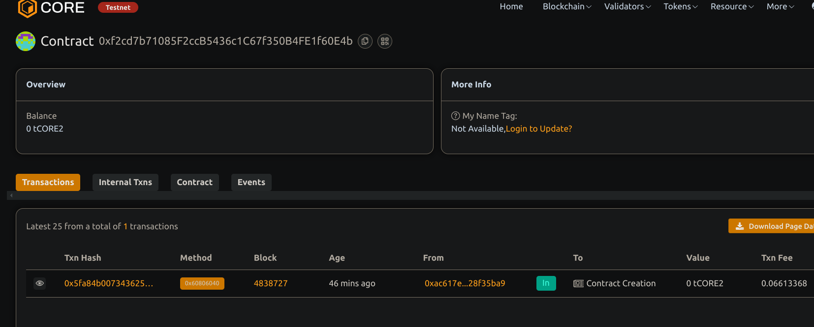

# Dynamic Bonding Curve Token Sale Mechanism

## Project Description

This smart contract  implements  an ERC20   token sale with a dynamic bonding curve pricing mechanism. The price per token increases linearly as more tokens are minted, providing a fair market-driven token price. 

## Project Vision

To create a decentralized, transparent token sale system where token price dynamically adjusts based on supply and demand using bonding curves, enabling fairer token distribution.    

## Key Features

- ERC20 token with minting and burning
- Linear bonding curve price calculation (price = basePrice + slope * supply)
- Users can buy tokens by paying ETH, price calculated dynamically
- Users can sell tokens back for ETH, price based on bonding curve
- Refund of excess ETH when purchasing tokens
- Owner starts with initial token supply  

## Future Scope

- Implement more advanced bonding curve formulas (e.g., exponential)
- Gas optimization for bulk price calculations
- Integration with front-end UI for token sale interaction
- Support for multiple token sales with different bonding curves
- Add governance and staking features

## Contract details 
project done by Shreyansh Singh 
0xf2cd7b71085F2ccB5436c1C67f350B4FE1f60E4b 
